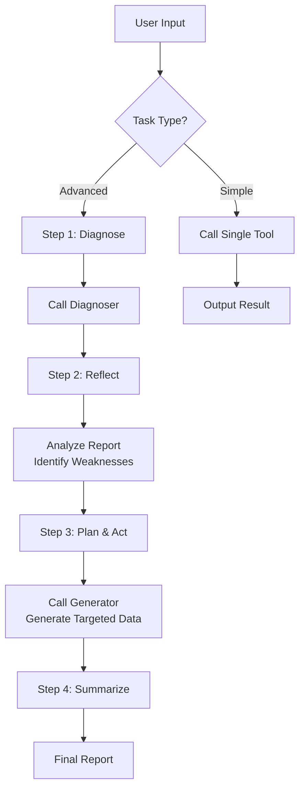

# Resp-Agent

> An intelligent respiratory sound analysis and generation system powered by DeepSeek API

[](./README_zh-CN.md)

## 📖 Overview

**Resp-Agent** is an AI agent system built on the ReAct (Reasoning + Acting) architecture, designed for respiratory sound medical diagnosis research. The system uses DeepSeek LLM as the "Thinker" to coordinate two core tools for a closed-loop "diagnose–reflect–plan–act" workflow:

- **Diagnoser**: Analyzes respiratory audio and EHR data, outputs detailed diagnosis reports
- **Generator**: Synthesizes high-fidelity respiratory sound samples for data augmentation

## 📁 Project Structure

```
Agent/
├── Resp_agent_chinese.py    # Chinese version of the Agent
├── Resp_agent_english.py    # English version of the Agent
├── Diagnoser/               # Diagnoser module
│   ├── diagnoser_pipeline.py    # Main diagnosis pipeline
│   ├── config.yaml              # Model configuration
│   ├── checkpoints/             # Model checkpoints
│   ├── pretrained_models/       # Pretrained models
│   └── example/                 # Example data (audio + metadata)
└── Generator/               # Generator module
    ├── generator_pipeline.py    # Main generation pipeline
    ├── models.py                # Model definitions
    ├── config.yaml              # Model configuration
    ├── checkpoints/             # Model checkpoints
    ├── pretrained_models/       # Pretrained models
    └── wav/                     # Reference audio directory
```

## ⚙️ Setup

### 1. Install Dependencies

```bash
pip install -r requirements.txt
```

Or install manually:
```bash
pip install openai pandas torch torchaudio transformers huggingface_hub
```

### 2. Download Model Weights

> [!IMPORTANT]
> **Model files (~22GB) are hosted on HuggingFace and must be downloaded before running!**

**Option A: Using download script (Recommended)**
```bash
python download_models.py
```

**Option B: Manual download**

Download from 🤗 [AustinZhang/resp-agent-models](https://huggingface.co/AustinZhang/resp-agent-models) and place files according to the directory structure below.

**DeepSeek-R1 Model** (downloaded separately):
```bash
# Using huggingface_hub
python -c "from huggingface_hub import snapshot_download; snapshot_download('deepseek-ai/DeepSeek-R1-Distill-Qwen-7B', local_dir='Diagnoser/checkpoints/deepseek-r1')"
```

Or download directly from: 🔗 [deepseek-ai/DeepSeek-R1-Distill-Qwen-7B](https://huggingface.co/deepseek-ai/DeepSeek-R1-Distill-Qwen-7B)

### 3. Configure DeepSeek API Key

> [!IMPORTANT]
> **This is a required step to run the Agent!**

1. Get your API key from [DeepSeek Platform](https://platform.deepseek.com/)
2. Set the environment variable:

**Linux/macOS:**
```bash
export DEEPSEEK_API_KEY='your-api-key-here'

# For permanent setup, add to ~/.bashrc or ~/.zshrc
echo "export DEEPSEEK_API_KEY='your-api-key-here'" >> ~/.bashrc
source ~/.bashrc
```

**Windows (PowerShell):**
```powershell
$env:DEEPSEEK_API_KEY = "your-api-key-here"
```

### 4. Verify Configuration

```bash
python -c "import os; print('API Key configured' if os.environ.get('DEEPSEEK_API_KEY') else 'API Key not found')"

# Verify model files
python download_models.py --verify-only
```

## 🚀 Quick Start

```bash
cd /path/to/Agent

# English version
python Resp_agent_english.py

# Chinese version
python Resp_agent_chinese.py
```

## 📋 Usage Guide

### Task Types

| Type | Description | Example |
|------|-------------|---------|
| **Simple** | Single tool call | `Diagnose respiratory sounds with audio_dir=./Diagnoser/example/audio` |
| **Advanced** | Closed-loop iteration | `Run a full iteration: diagnose, then generate targeted data based on weaknesses` |

### Tool Call Formats

**Diagnoser:**
```
[Call:Diagnoser] Diagnose respiratory sounds with audio_dir=<path>, output_dir=<path>, metadata_csv=<path>
```

| Parameter | Description | Default |
|-----------|-------------|---------|
| `audio_dir` | Audio files directory | `./Diagnoser/example/audio` |
| `output_dir` | Output directory | `./Diagnoser/output_diagnose` |
| `metadata_csv` | EHR CSV file path | `./Diagnoser/example/combined_metadata.csv` |

**Generator:**
```
[Call:Generator] Generate <disease> respiratory audio with ref_audio=<path.wav>, disease=<disease>, out_dir=<path>
```

| Parameter | Description | Default |
|-----------|-------------|---------|
| `ref_audio` | Reference audio (.wav) | `./Generator/wav/reference_audio.wav` |
| `disease` | Target disease label | `Asthma` |
| `out_dir` | Output directory | `./Generator/output_generate` |

### Interactive Commands

| Command | Function |
|---------|----------|
| `help` / `examples` | Show task templates |
| `quit` / `exit` | Exit the Agent |

## 🔄 Workflow



## ⚠️ Troubleshooting

| Issue | Solution |
|-------|----------|
| `DEEPSEEK_API_KEY not set` | Configure the environment variable as shown above |
| `API connection failed` | Check API key validity and network connectivity |
| `Script not found` | Run from the `Agent/` directory |

## 🔧 Technical Details

### DeepSeek API Configuration

```python
from openai import OpenAI

client = OpenAI(
    api_key=os.environ.get("DEEPSEEK_API_KEY"),
    base_url="https://api.deepseek.com"
)
```

- **Model**: `deepseek-chat`
- **Temperature**: `0.7`
- **Top-P**: `0.9`

### Supported Disease Types

- Asthma
- COVID-19
- COPD
- Other respiratory conditions (based on training data)

## 🙏 Acknowledgements

This project is built upon the following excellent open-source projects:

- [BEATs](https://github.com/microsoft/unilm/tree/master/beats) - Audio Pre-Training with Acoustic Tokenizers (Microsoft)
- [DeepSeek-R1](https://github.com/deepseek-ai/DeepSeek-R1) - Reasoning model powering the Thinker agent
- [Longformer](https://github.com/allenai/longformer) - Long document transformer for EHR processing
- [Qwen3](https://github.com/QwenLM/Qwen3) - Large language model foundation

We sincerely thank the developers and contributors of these projects!

## 📄 License

This project is for academic research purposes only.

## 📧 Contact

For questions or feedback, please contact:

**Email**: [pzhang176@connect.hkust-gz.edu.cn](mailto:pzhang176@connect.hkust-gz.edu.cn)

---

*Last updated: February 2026*
