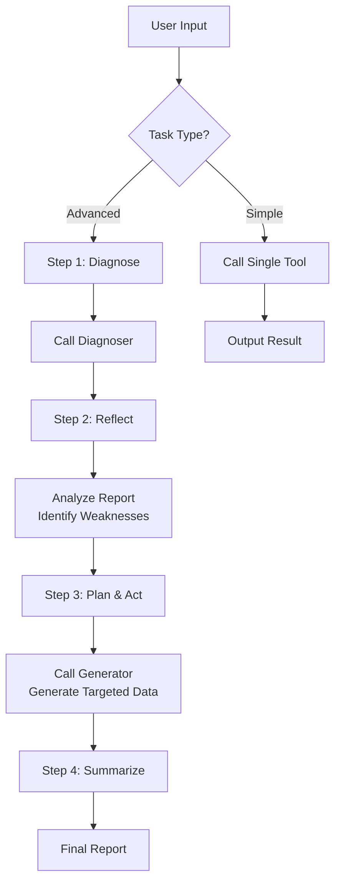

# Resp-Agent

> An intelligent respiratory sound analysis and generation system powered by DeepSeek API

[](./README_zh-CN.md)

## 📖 Overview

**Resp-Agent** is an AI agent system built on the ReAct (Reasoning + Acting) architecture, designed for respiratory sound medical diagnosis research. The system uses DeepSeek LLM as the "Thinker" to coordinate two core tools for a closed-loop "diagnose–reflect–plan–act" workflow:

- **Diagnoser**: Analyzes respiratory audio and EHR data, outputs detailed diagnosis reports
- **Generator**: Synthesizes high-fidelity respiratory sound samples for data augmentation

## 📁 Project Structure

```
Agent/
├── Resp_agent_chinese.py    # Chinese version of the Agent
├── Resp_agent_english.py    # English version of the Agent
├── Diagnoser/               # Diagnoser module
│   ├── diagnoser_pipeline.py    # Main diagnosis pipeline
│   ├── config.yaml              # Model configuration
│   ├── checkpoints/             # Model checkpoints
│   ├── pretrained_models/       # Pretrained models
│   └── example/                 # Example data (audio + metadata)
└── Generator/               # Generator module
    ├── generator_pipeline.py    # Main generation pipeline
    ├── models.py                # Model definitions
    ├── config.yaml              # Model configuration
    ├── checkpoints/             # Model checkpoints
    ├── pretrained_models/       # Pretrained models
    └── wav/                     # Reference audio directory
```

## ⚙️ Setup

### 1. Clone Repository & Create Environment

```bash
git clone https://github.com/zpforlove/Resp-Agent.git
cd Resp-Agent
conda create -n breath python=3.10 -y
conda activate breath
```

### 2. Install PyTorch with CUDA Support

```bash
pip install torch==2.8.0 torchaudio==2.8.0 --index-url https://download.pytorch.org/whl/cu128
```

### 3. Install resp-agent

```bash
pip install resp-agent -i https://pypi.org/simple/
```
> This installs all dependencies for both inference and training (including `deepspeed`, `wandb`, `matplotlib`, etc.).

### 4. Download Model Weights

> [!IMPORTANT]
> **Model files (~16GB) are hosted on HuggingFace. Must download before running!**

Download from 🤗 [AustinZhang/resp-agent-models](https://huggingface.co/AustinZhang/resp-agent-models) and place files according to the directory structure.

### 5. Configure DeepSeek API Key

> [!IMPORTANT]
> **This is a required step to run the Agent!**

1. Get your API key from [DeepSeek Platform](https://platform.deepseek.com/)
2. Set the environment variable:

**Linux/macOS (temporary):**
```bash
export DEEPSEEK_API_KEY='your-api-key-here'
```

**Linux/macOS (permanent, recommended):**
```bash
# Add to ~/.bashrc or ~/.zshrc
echo "export DEEPSEEK_API_KEY='your-api-key-here'" >> ~/.bashrc
source ~/.bashrc
```

**Windows (PowerShell):**
```powershell
$env:DEEPSEEK_API_KEY = "your-api-key-here"
```

**Windows (permanent):**
```
System Properties → Advanced → Environment Variables → New User Variable
Variable name: DEEPSEEK_API_KEY
Variable value: your-api-key-here
```

### 6. Verify Configuration

```bash
python -c "import os; print('API Key configured' if os.environ.get('DEEPSEEK_API_KEY') else 'API Key not found')"
```

### 7. Quick Start

> [!NOTE]
> Make sure you have completed all setup steps above (model downloads + API key configuration) before running.

#### Interactive Chat (Recommended)

Start the interactive agent to perform diagnosis, generation, and closed-loop iteration through natural language:

```bash
resp-agent chat --lang en   # English interactive agent
resp-agent chat --lang zh   # Chinese interactive agent
```

#### Alternative: Batch Tools

Run diagnosis or generation directly as one-shot commands (no interactive loop):

```bash
# Diagnose respiratory sounds
resp-agent diagnose --audio_dir ./Diagnoser/example/audio --output_dir ./output \
    --metadata_csv ./Diagnoser/example/combined_metadata.csv --config ./Diagnoser/config.yaml

# Generate respiratory sounds
resp-agent generate --ref_audio ./Generator/wav/reference_audio.wav --disease Asthma \
    --out_dir ./output --config ./Generator/config.yaml
```

#### Using Python scripts:
```bash
# English version
python Resp_agent_english.py

# Chinese version
python Resp_agent_chinese.py
```

### 8. Download Dataset (For Training)

> [!NOTE]
> **Resp-229K dataset (~70GB, 229K audio files, 407+ hours) is hosted on HuggingFace. Required only for training/fine-tuning.**

Download from 🤗 [AustinZhang/resp-agent-dataset](https://huggingface.co/datasets/AustinZhang/resp-agent-dataset):
```python
from huggingface_hub import snapshot_download

snapshot_download(
    repo_id="AustinZhang/resp-agent-dataset",
    repo_type="dataset",
    local_dir="./data"
)
```

Then update paths in `Diagnoser/config.yaml`:
```yaml
data:
  train_root: "./data/train"
  val_root: "./data/valid"
  test_root: "./data/test"
```

## 🏋️ Training

> [!NOTE]
> **Training requires GPU(s) with CUDA support. Make sure you have installed `resp-agent` (Step 3) and downloaded the dataset (Step 8).**

### Prerequisites

1. Login to Weights & Biases for experiment tracking:
   ```bash
   wandb login
   ```

3. Update data paths in the corresponding `config.yaml` files.

### Train Diagnoser (Longformer)

```bash
cd Diagnoser
deepspeed train_longformer.py \
    --deepspeed \
    --deepspeed_config ds_config_longformer.json \
    --config config.yaml
```

### Train Generator — CFM Model

```bash
cd Generator
deepspeed train_cfm.py \
    --deepspeed \
    --deepspeed_config ds_config_cfm.json \
    --config config.yaml
```

### Train Generator — LLM Model

```bash
cd Generator
deepspeed train_llm.py \
    --deepspeed \
    --deepspeed_config ds_config_llm.json \
    --config config.yaml
```

> [!TIP]
> - DeepSpeed configs (`ds_config_*.json`) control distributed training settings such as ZeRO stage, gradient accumulation, and mixed precision. Modify them to fit your hardware setup.
> - Model hyperparameters are defined in `config.yaml` within each module directory.
> - Training logs and metrics are automatically tracked via W&B.

## 📋 Usage Guide

### Task Types

| Type | Description | Example |
|------|-------------|---------|
| **Simple** | Single tool call | `Diagnose respiratory sounds with audio_dir=./Diagnoser/example/audio` |
| **Advanced** | Closed-loop iteration | `Run a full iteration: diagnose, then generate targeted data based on weaknesses` |

### Tool Call Formats

**Diagnoser:**
```
[Call:Diagnoser] Diagnose respiratory sounds with audio_dir=<path>, output_dir=<path>, metadata_csv=<path>
```

| Parameter | Description | Default |
|-----------|-------------|---------|
| `audio_dir` | Audio files directory | `./Diagnoser/example/audio` |
| `output_dir` | Output directory | `./Diagnoser/output_diagnose` |
| `metadata_csv` | EHR CSV file path | `./Diagnoser/example/combined_metadata.csv` |

**Generator:**
```
[Call:Generator] Generate <disease> respiratory audio with ref_audio=<path.wav>, disease=<disease>, out_dir=<path>
```

| Parameter | Description | Default |
|-----------|-------------|---------|
| `ref_audio` | Reference audio (.wav) | `./Generator/wav/reference_audio.wav` |
| `disease` | Target disease label | `Asthma` |
| `out_dir` | Output directory | `./Generator/output_generate` |

### Interactive Commands

| Command | Function |
|---------|----------|
| `help` / `examples` / `template` | Show task templates |
| `quit` / `exit` / `stop` | Exit the Agent |

## 🔄 Workflow



## ⚠️ Troubleshooting

| Issue | Solution |
|-------|----------|
| `DEEPSEEK_API_KEY not set` | Configure the environment variable as shown above |
| `API connection failed` | Check API key validity and network connectivity |
| `Script not found` | Run from the `Agent/` directory |

## 🔧 Technical Details

### DeepSeek API Configuration

```python
from openai import OpenAI

client = OpenAI(
    api_key=os.environ.get("DEEPSEEK_API_KEY"),
    base_url="https://api.deepseek.com"
)
```

- **Model**: `deepseek-chat`
- **Temperature**: `0.7`
- **Top-P**: `0.9`

### Supported Disease Types

- Asthma
- COVID-19
- COPD
- Other respiratory conditions (based on training data)

## 🙏 Acknowledgements

This project is built upon the following excellent open-source projects:

- [BEATs](https://github.com/microsoft/unilm/tree/master/beats) - Audio Pre-Training with Acoustic Tokenizers
- [DeepSeek-R1](https://github.com/deepseek-ai/DeepSeek-R1) - Reasoning model powering the Thinker agent
- [Longformer](https://github.com/allenai/longformer) - Long document transformer for EHR processing
- [Qwen3](https://github.com/QwenLM/Qwen3) - Large language model foundation

We sincerely thank the developers and contributors of these projects!

## 📄 License

This project is licensed under the [MIT License](./LICENSE).

## 📧 Contact

For questions or feedback, please contact:

**Email**: [pzhang176@connect.hkust-gz.edu.cn](mailto:pzhang176@connect.hkust-gz.edu.cn)
