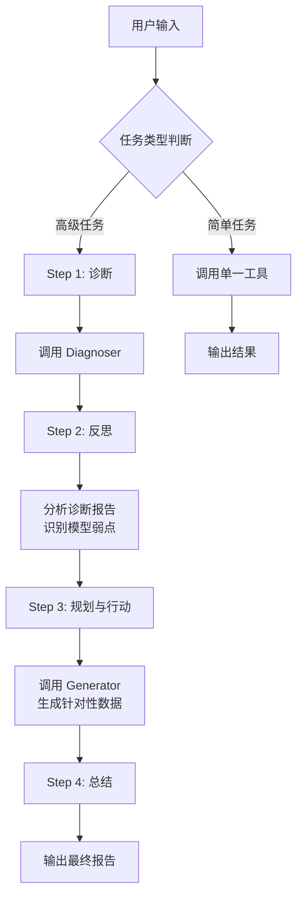

# Resp-Agent 使用指南

> 一个基于 DeepSeek API 的智能呼吸音分析与生成系统

[](./README.md)

## 📖 项目简介

**Resp-Agent** 是一个基于 ReAct (Reasoning + Acting) 架构的 AI 代理系统，专为呼吸音医学诊断研究设计。该系统通过 DeepSeek 大语言模型作为"思考者"（Thinker），协调两个核心工具来实现闭环的"诊断-反思-规划-行动"工作流：

- **Diagnoser（诊断器）**：分析呼吸音数据和电子病历，输出详细诊断报告
- **Generator（生成器）**：合成高保真呼吸音样本，用于数据增强

## 📁 项目结构

```
Agent/
├── Resp_agent_chinese.py    # 中文版 Agent 主程序
├── Resp_agent_english.py    # 英文版 Agent 主程序
├── Diagnoser/               # 诊断器模块
│   ├── diagnoser_pipeline.py    # 诊断流水线主程序
│   ├── config.yaml              # 模型配置文件
│   ├── checkpoints/             # 模型检查点
│   ├── pretrained_models/       # 预训练模型
│   └── example/                 # 示例数据（音频+元数据）
└── Generator/               # 生成器模块
    ├── generator_pipeline.py    # 生成流水线主程序
    ├── models.py                # 生成模型定义
    ├── config.yaml              # 模型配置文件
    ├── checkpoints/             # 模型检查点
    ├── pretrained_models/       # 预训练模型
    └── wav/                     # 参考音频目录
```

## ⚙️ 环境配置

### 1. 克隆仓库并创建环境

```bash
git clone https://github.com/zpforlove/Resp-Agent.git
cd Resp-Agent
conda create -n breath python=3.10 -y
conda activate breath
```

### 2. 安装 PyTorch（CUDA 支持）

```bash
pip install torch==2.8.0 torchaudio==2.8.0 --index-url https://download.pytorch.org/whl/cu128
```

### 3. 安装 resp-agent

```bash
pip install resp-agent -i https://pypi.org/simple/
```
> 此命令会一次性安装推理和训练所需的全部依赖（包括 `deepspeed`、`wandb`、`matplotlib` 等）。

### 4. 下载模型权重

> [!IMPORTANT]
> **模型文件（~16GB）托管在 HuggingFace，运行前必须下载！**

从 🤗 [AustinZhang/resp-agent-models](https://huggingface.co/AustinZhang/resp-agent-models) 下载并按下面的目录结构放置文件。

**DeepSeek-R1 模型**（单独下载）：
```bash
# 使用 huggingface_hub
python -c "from huggingface_hub import snapshot_download; snapshot_download('deepseek-ai/DeepSeek-R1-Distill-Qwen-7B', local_dir='Diagnoser/checkpoints/deepseek-r1')"
```

或直接从这里下载：🔗 [deepseek-ai/DeepSeek-R1-Distill-Qwen-7B](https://huggingface.co/deepseek-ai/DeepSeek-R1-Distill-Qwen-7B)

### 5. DeepSeek API Key 配置

> [!IMPORTANT]
> **这是运行 Agent 必需的关键步骤！**

您需要先获取 DeepSeek API Key：
1. 访问 [DeepSeek 官网](https://platform.deepseek.com/) 注册账号
2. 在控制台创建 API Key
3. 配置环境变量：

**Linux/macOS 临时设置：**
```bash
export DEEPSEEK_API_KEY='your-api-key-here'
```

**Linux/macOS 永久设置（推荐）：**
```bash
# 添加到 ~/.bashrc 或 ~/.zshrc
echo "export DEEPSEEK_API_KEY='your-api-key-here'" >> ~/.bashrc
source ~/.bashrc
```

**Windows (PowerShell)：**
```powershell
$env:DEEPSEEK_API_KEY = "your-api-key-here"
```

**Windows 永久设置：**
```
系统属性 → 高级 → 环境变量 → 新建用户变量
变量名: DEEPSEEK_API_KEY
变量值: your-api-key-here
```

### 6. 验证配置

```bash
python -c "import os; print('API Key 已配置' if os.environ.get('DEEPSEEK_API_KEY') else '未检测到 API Key')"
```

### 7. 快速开始

> [!NOTE]
> 请确保您已完成上述所有配置步骤（模型下载 + API Key 配置）后再运行。

#### 交互式聊天（推荐）

启动交互式智能体，通过自然语言进行诊断、生成和闭环迭代：

```bash
resp-agent chat --lang zh   # 中文版交互智能体
resp-agent chat --lang en   # 英文版交互智能体
```

#### 备选：批处理工具

直接运行单次诊断或生成命令（无交互循环）：

```bash
# 诊断呼吸音
resp-agent diagnose --audio_dir ./Diagnoser/example/audio --output_dir ./output \
    --metadata_csv ./Diagnoser/example/combined_metadata.csv --config ./Diagnoser/config.yaml

# 生成呼吸音
resp-agent generate --ref_audio ./Generator/wav/reference_audio.wav --disease Asthma \
    --out_dir ./output --config ./Generator/config.yaml
```

#### 使用 Python 脚本：

**中文版：**
```bash
python Resp_agent_chinese.py
```

**英文版：**
```bash
python Resp_agent_english.py
```

### 8. 下载数据集（训练用）

> [!NOTE]
> **Resp-229K 数据集（~70GB，229K 音频文件，407+ 小时）托管在 HuggingFace。仅训练/微调时需要下载。**

从 🤗 [AustinZhang/resp-agent-dataset](https://huggingface.co/datasets/AustinZhang/resp-agent-dataset) 下载：
```python
from huggingface_hub import snapshot_download

snapshot_download(
    repo_id="AustinZhang/resp-agent-dataset",
    repo_type="dataset",
    local_dir="./data"
)
```

然后在 `Diagnoser/config.yaml` 中更新路径：
```yaml
data:
  train_root: "./data/train"
  val_root: "./data/valid"
  test_root: "./data/test"
```

## 🏋️ 模型训练

> [!NOTE]
> **训练需要支持 CUDA 的 GPU。请确保已安装 `resp-agent`（步骤 3）并已下载数据集（步骤 8）。**

### 前置准备

1. 登录 Weights & Biases 进行实验追踪：
   ```bash
   wandb login
   ```

3. 在对应的 `config.yaml` 文件中更新数据路径。

### 训练 Diagnoser（Longformer）

```bash
cd Diagnoser
deepspeed train_longformer.py \
    --deepspeed \
    --deepspeed_config ds_config_longformer.json \
    --config config.yaml
```

### 训练 Generator — CFM 模型

```bash
cd Generator
deepspeed train_cfm.py \
    --deepspeed \
    --deepspeed_config ds_config_cfm.json \
    --config config.yaml
```

### 训练 Generator — LLM 模型

```bash
cd Generator
deepspeed train_llm.py \
    --deepspeed \
    --deepspeed_config ds_config_llm.json \
    --config config.yaml
```

> [!TIP]
> - DeepSpeed 配置文件（`ds_config_*.json`）控制分布式训练设置，如 ZeRO 优化阶段、梯度累积和混合精度。请根据您的硬件配置进行调整。
> - 模型超参数在各模块目录下的 `config.yaml` 中定义。
> - 训练日志和指标通过 W&B 自动跟踪。

## 📋 使用指南

### 任务类型

Resp-Agent 支持两种任务模式：

#### A. 简单任务（单工具调用）

| 任务类型 | 示例输入 |
|---------|---------|
| 仅诊断 | `帮我诊断呼吸音，音频目录是 ./Diagnoser/example/audio，病历文档在 ./Diagnoser/example/combined_metadata.csv` |
| 仅生成 | `帮我生成疾病类型为Asthma的呼吸音，参考音频是 ./Generator/wav/reference_audio.wav，输出到 ./Generator/output_generate` |

#### B. 高级任务（闭环迭代）

```
启动一次完整的迭代分析：使用 ./Diagnoser/example/audio 和 ./Diagnoser/example/combined_metadata.csv 进行诊断，
然后根据弱点，使用 ./Generator/wav/reference_audio.wav 作为风格参考，在 ./Generator/output_generate 生成数据。
```

### 工具调用格式

**Diagnoser 诊断器：**
```
[Call:Diagnoser] 帮我诊断呼吸音，音频目录是 <path>，输出目录是 <path>，病历文档在 <path>
```

参数说明：
| 参数 | 说明 | 默认值 |
|-----|------|-------|
| `音频目录` / `audio_dir` | 呼吸音音频文件目录 | `./Diagnoser/example/audio` |
| `输出目录` / `output_dir` | 诊断结果输出目录 | `./Diagnoser/output_diagnose` |
| `病历文档` / `metadata_csv` | 电子病历 CSV 文件路径 | `./Diagnoser/example/combined_metadata.csv` |

**Generator 生成器：**
```
[Call:Generator] 生成<疾病名>呼吸音，参考音频是 <path.wav>，疾病类型为 <疾病名>，输出目录是 <path>
```

参数说明：
| 参数 | 说明 | 默认值 |
|-----|------|-------|
| `参考音频` / `ref_audio` | 风格参考音频（.wav）| `./Generator/wav/reference_audio.wav` |
| `疾病类型` / `disease` | 目标疾病标签 | `Asthma` |
| `输出目录` / `out_dir` | 生成音频输出目录 | `./Generator/output_generate` |

### 交互命令

| 命令 | 功能 |
|-----|------|
| `模板` / `help` / `template` / `examples` | 显示任务示例模板 |
| `停止` / `quit` / `exit` / `stop` | 退出 Agent 系统 |

## 🔄 工作流程

### 高级任务工作流



### 示例：完整迭代分析

**输入：**
```
帮我分析 ./Diagnoser/example/audio 目录下的呼吸音，并根据诊断弱点生成改进数据
```

**Agent 执行流程：**
1. **诊断阶段**：分析音频数据，生成诊断报告
2. **反思阶段**：识别 COVID-19 与对照组的混淆问题（准确率 60%）
3. **生成阶段**：针对性生成 COVID-19 样本
4. **总结阶段**：报告完成的工作和生成文件位置

## ⚠️ 常见问题

### 1. API Key 未配置

```
[错误] 未检测到 DEEPSEEK_API_KEY 环境变量。
```

**解决方案：** 按照上述 API Key 配置步骤设置环境变量。

### 2. API 连接失败

```
[错误] DeepSeek API 客户端初始化或连接失败
```

**解决方案：**
- 检查 API Key 是否正确
- 确认网络连接正常
- 验证是否可以访问 `https://api.deepseek.com`

### 3. 诊断器/生成器脚本未找到

```
错误: 未找到 Python 或 diagnoser_pipeline.py
```

**解决方案：** 确保在 `Agent/` 目录下运行程序，且子模块目录结构完整。

### 4. 电子病历格式不匹配

**解决方案：** 确保您的 CSV 文件：
- 包含必需的表头字段
- 每个患者至少有两条呼吸音记录

## 📊 输出示例

### 诊断报告示例

```
诊断成功完成。
分析结果已保存至: /path/to/output_diagnose/results.csv

【诊断摘要】
总共 20 个文件, COVID 匹配正确 12 个 (准确率: 60.00%)

主要错误混淆对 (GT -> Pred):
Positive -> Control Group: 7次

详细结果 (前20行):
patient_id  audio_file  predicted_disease  covid_test_result(GT)  covid_match
...
```

### 生成结果示例

```
音频生成成功。文件已保存至: /path/to/output_generate/COVID-19_generated.wav
```

## 🔧 技术细节

### DeepSeek API 配置

Agent 使用 OpenAI SDK 兼容接口调用 DeepSeek API：

```python
from openai import OpenAI

client = OpenAI(
    api_key=os.environ.get("DEEPSEEK_API_KEY"),
    base_url="https://api.deepseek.com"
)
```

API 调用参数：
- **模型**: `deepseek-chat`
- **温度**: `0.7`
- **Top-P**: `0.9`
- **流式输出**: `False`（ReAct 循环必需）

### 支持的疾病类型

Generator 支持生成以下类型的呼吸音：
- Asthma（哮喘）
- COVID-19
- COPD（慢性阻塞性肺疾病）
- 其他呼吸系统疾病（根据模型训练数据）

## � 致谢

本项目的开发得益于以下优秀的开源项目：

- [BEATs](https://github.com/microsoft/unilm/tree/master/beats) - 基于声学 Tokenizer 的音频预训练框架
- [DeepSeek-R1](https://github.com/deepseek-ai/DeepSeek-R1) - 为 Thinker 智能体提供推理能力的模型
- [Longformer](https://github.com/allenai/longformer) - 用于电子病历处理的长文档 Transformer
- [Qwen3](https://github.com/QwenLM/Qwen3) - 大语言模型基础架构

在此向这些项目的开发者和贡献者表示衷心的感谢！

## 📄 许可证

本项目使用 [MIT 许可证](./LICENSE)。

## 📧 联系方式

如有问题，请联系：

**邮箱**: [pzhang176@connect.hkust-gz.edu.cn](mailto:pzhang176@connect.hkust-gz.edu.cn)
